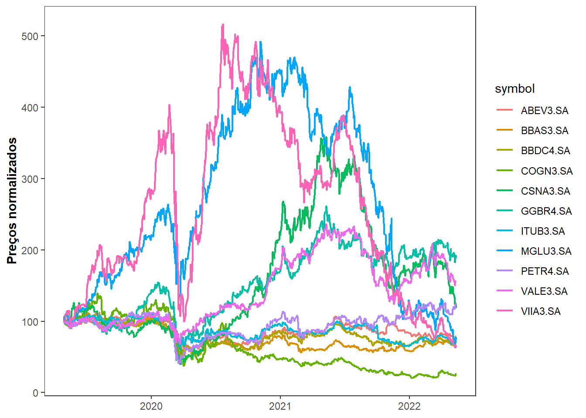

## Diversificação

Translating a Python Colab script, shared by profesor Daniel, to R.


```r
library(tidyverse)
library(tidyquant)
library(tsibble)
```


```r
tickers <- c("ITUB3.SA", 'BBAS3.SA', "ABEV3.SA", "MGLU3.SA", "VIIA3.SA", "VALE3.SA", "PETR4.SA", "ABEV3.SA", "BBDC4.SA", "GGBR4.SA", "CSNA3.SA", "COGN3.SA")

data <-  tq_get( tickers, get = "stock.prices", from = "2019-04-29")  #Downloading the data from the above company

head(data)
```


```
## Rows: 9060 Columns: 8
```

```
## -- Column specification --------------------------------------------------------
## Delimiter: ","
## chr  (1): symbol
## dbl  (6): open, high, low, close, volume, adjusted
## date (1): date
```

```
## 
## i Use `spec()` to retrieve the full column specification for this data.
## i Specify the column types or set `show_col_types = FALSE` to quiet this message.
```

```
## # A tibble: 6 x 8
##   symbol   date        open  high   low close volume adjusted
##   <chr>    <date>     <dbl> <dbl> <dbl> <dbl>  <dbl>    <dbl>
## 1 ITUB3.SA 2019-04-29  29.5  29.5  29.1  29.4 108200     26.7
## 2 ITUB3.SA 2019-04-30  29.7  29.7  29.1  29.4 228400     26.7
## 3 ITUB3.SA 2019-05-02  29.4  29.6  29.2  29.5 309200     26.8
## 4 ITUB3.SA 2019-05-03  29.7  29.8  29.2  29.3 200500     26.6
## 5 ITUB3.SA 2019-05-06  29.1  29.1  28.7  28.7 236900     26.1
## 6 ITUB3.SA 2019-05-07  28.7  28.8  28.1  28.5 417500     25.9
```


Building a plot showing the normalized prices.


```r
data %>% 
    group_by(symbol) %>% 
    mutate(norm_price = close/close[1]*100) %>% 
    ggplot(aes(date, norm_price)) +
    geom_line(aes(color = symbol), size = 0.8) +
    labs(y = "Preços normalizados", x = NULL) +

# Agora, irei aplicar algumas modificações estéticias. Apenas por gosto pessoal.
    theme_bw( base_family = "Roboto Condensed") +
 #   guides(color = FALSE) +
  #  geom_text(data = filter(data, date == last(date)),aes(label = symbol)) +
    theme(panel.grid =  element_blank(),
          axis.title.y = element_text(face = "bold")
    )
```

```
## Warning in grid.Call(C_stringMetric, as.graphicsAnnot(x$label)): font family not
## found in Windows font database

## Warning in grid.Call(C_stringMetric, as.graphicsAnnot(x$label)): font family not
## found in Windows font database
```

```
## Warning in grid.Call(C_textBounds, as.graphicsAnnot(x$label), x$x, x$y, : font
## family not found in Windows font database

## Warning in grid.Call(C_textBounds, as.graphicsAnnot(x$label), x$x, x$y, : font
## family not found in Windows font database

## Warning in grid.Call(C_textBounds, as.graphicsAnnot(x$label), x$x, x$y, : font
## family not found in Windows font database

## Warning in grid.Call(C_textBounds, as.graphicsAnnot(x$label), x$x, x$y, : font
## family not found in Windows font database

## Warning in grid.Call(C_textBounds, as.graphicsAnnot(x$label), x$x, x$y, : font
## family not found in Windows font database

## Warning in grid.Call(C_textBounds, as.graphicsAnnot(x$label), x$x, x$y, : font
## family not found in Windows font database
```

```
## Warning in grid.Call.graphics(C_text, as.graphicsAnnot(x$label), x$x, x$y, :
## font family not found in Windows font database
```

```
## Warning in grid.Call(C_textBounds, as.graphicsAnnot(x$label), x$x, x$y, : font
## family not found in Windows font database

## Warning in grid.Call(C_textBounds, as.graphicsAnnot(x$label), x$x, x$y, : font
## family not found in Windows font database
```



### Simulação de pesos para carteira de ativos


```r
# We create a grouped dataset, so every function is applied over each ticker (company)

log_returns <- data %>% 
    group_by(symbol) %>% 
    #Daily log returns for the close price
    tq_transmute(select = close, mutate_fun = dailyReturn, type = "log") %>% 
    ungroup()

str(log_returns)
```

```
## tibble [8,305 x 3] (S3: tbl_df/tbl/data.frame)
##  $ symbol       : chr [1:8305] "ITUB3.SA" "ITUB3.SA" "ITUB3.SA" "ITUB3.SA" ...
##  $ date         : Date[1:8305], format: "2019-04-29" "2019-04-30" ...
##  $ daily.returns: num [1:8305] 0 0 0.00374 -0.00579 -0.02105 ...
```

```r
mean_returns <- log_returns %>% 
    group_by(symbol) %>% 
    summarise(mean_return = mean(daily.returns))

mean_returns
```

```
## # A tibble: 11 x 2
##    symbol   mean_return
##    <chr>          <dbl>
##  1 ABEV3.SA   -0.000308
##  2 BBAS3.SA   -0.000451
##  3 BBDC4.SA   -0.000434
##  4 COGN3.SA   -0.00178 
##  5 CSNA3.SA    0.000285
##  6 GGBR4.SA    0.000872
##  7 ITUB3.SA   -0.000435
##  8 MGLU3.SA   -0.000320
##  9 PETR4.SA    0.000298
## 10 VALE3.SA    0.000579
## 11 VIIA3.SA   -0.000521
```


```r
set.seed(1)
nticks = length(tickers)
nsample = 10000
port_returns = c()
port_vol = c()
all_weights <- matrix(nrow=nsample, ncol = nticks)
exp_return <- rep(0, nsample)
exp_var <- rep(0, nsample)
exp_std <- rep(0, nsample)
sharpe <- matrix(0, nrow=10000, ncol=1)
```
 

```r
weights <- runif(nticks, min= 0, max = 1) #Selects 10 floats from a uniform distribution between 0 and 1

weights <- weights/sum(weights) # Normalizes the weights, so the elements sum up to 1
m1 <- matrix(weights, ncol = nticks)
```


